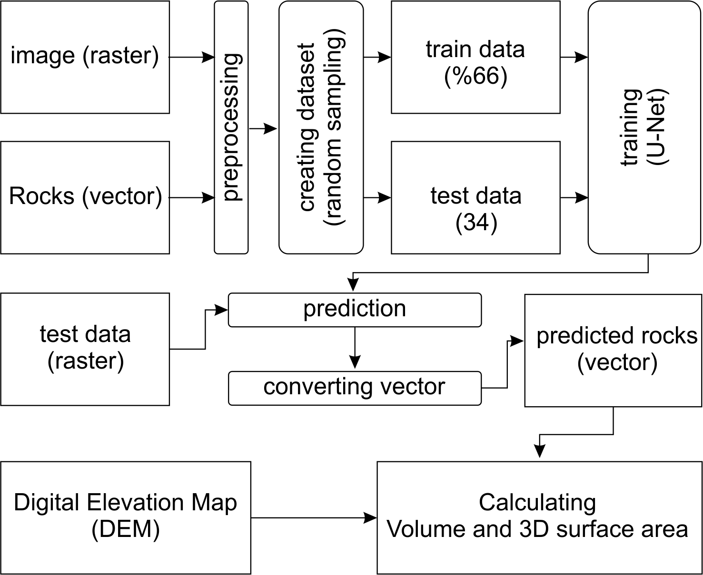

# rock_segmentation



## Citation

If you use this work, please cite:

> Polat, A. A fast method for detecting rock blocks deposits and calculating volumes and 3D surface areas. *Appl Geomat* 18, 70 (2026). https://doi.org/10.1007/s12518-026-00729-8

```bibtex
@article{polat2026,
  author  = {Polat, A.},
  title   = {A fast method for detecting rock blocks deposits and calculating volumes and 3D surface areas},
  journal = {Applied Geomatics},
  volume  = {18},
  pages   = {70},
  year    = {2026},
  doi     = {10.1007/s12518-026-00729-8}
}
```
